# TechJam Conversational E-Commerce Search — Submission

Our submission for the **TikTok TechJam 2026, Track 4: Shopping Copilot — AI Conversational Search and Recommendations**.

The task: build a multi-turn shopping agent that, within at most 10 turns, asks useful clarification
questions and surfaces a hidden target product (identified only by `parent_asin`) in a ranked Top‑10
list, against a frozen 50,000‑item `Clothing_Shoes_and_Jewelry` catalog and a deterministic customer
simulator. Full rules are in [`docs/competition_specification.md`](docs/competition_specification.md)
and [`docs/submission_rules.md`](docs/submission_rules.md); the organizer-provided quick start is in
[`TECHJAM-README.md`](TECHJAM-README.md).

## Submission Entry Point

- **Agent class:** [`starter/agent.py`](starter/agent.py) — `Agent`
- **Interface:** `reset(session_id, user_profile)` / `respond(session_id, user_message, turn, top_k)`,
  matching the required contract exactly (see [`docs/agent_api_contract.json`](docs/agent_api_contract.json)).
- **Dependencies:** Python standard library only (`sqlite3`, `urllib`, `json`, `re`, `math`, `dataclasses`).
  No `requirements.txt` is needed to run the agent itself.
- Earlier development iterations (`baseline-agent.py`, `jzy_agent*.py`, `my_agent.py`) are kept in the
  full development repository's history but are **not** shipped here; `starter/agent.py` is the only
  submitted entry point.

## How to Run

```bash
# 1. data/catalog.jsonl (50,000 rows) and data/public_set.jsonl are already included in this repo.

# 2. (Optional) Start a local Ollama server for LLM-assisted extraction/reranking
ollama serve
ollama pull qwen3:4b
ollama pull nomic-embed-text   # only needed for RERANK_METHOD=embedding

# 3. Run the official local evaluator against the 200-session public set
python3 -m evaluator.local_evaluator
```

This writes per-session results and aggregate metrics to `results.json` and prints the aggregate
summary to stdout. Requires Python 3.10+ (matching the organizer's recommendation); the agent code
itself is written to also run under 3.9.

## Method

`Agent` is a stateful hybrid retrieval system with an optional local LLM in the loop. Per session it
maintains a `SessionState` (accumulated constraints, asked/no-preference attributes, excluded ASINs,
conversation route). Each `respond()` call runs the following pipeline:

```mermaid
flowchart TD
    Start(["reset(): initialize session"]) --> Msg(["Customer message received"])
    Msg --> Respond["respond(): exclude ASINs\nalready shown this session"]
    Respond --> NoPref

    subgraph EXTRACT["① Constraint & Intent Extraction"]
        NoPref{"Exact-phrase match for\n'no preference for X'?"}
        Fast["Mark attribute X as\nno_preference (skip LLM)"]
        Extract[["LLM constraint & intent extraction\n(covers paraphrased no_preference\nand override)"]]
        Fallback["Regex-based constraint extraction\n(material, color, budget, etc.)"]
        Override{"Classified intent"}
        Merge["Merge accepted constraints\ninto session state"]

        NoPref -- match --> Fast --> Merge
        NoPref -- "no match" --> Extract
        Extract -- "unavailable / timeout /\ninvalid response" --> Fallback --> Override
        Extract -- "valid response" --> Override
        Override -- "override" --> Merge
        Override -- "other" --> Merge
    end

    Merge --> Retrieve

    subgraph RETRIEVE["② Route & Retrieve"]
        Retrieve["BM25 retrieval (SQLite FTS5),\nweighted by buying vs. browsing route,\nrecalls max(top_k×8, 40) candidates"]
    end

    Retrieve --> Method

    subgraph RERANK["③ Rerank"]
        Method{"Rule-based rerank,\nthen RERANK_METHOD"}
        LLMRerank[["LLM rerank: score\ntop-10 (0-4), reorder"]]
        EmbedRerank[["Embedding rerank: cosine\nsimilarity over top-30"]]
        Method -- "llm" --> LLMRerank
        Method -- "embedding" --> EmbedRerank
    end

    LLMRerank --> Stop
    EmbedRerank --> Stop

    subgraph OUTPUT["④ Clarify & Respond"]
        Stop{"turn ≥ 10, or\n(≤10 candidates & ≥2 constraints)?"}
        None["ask_attribute = null"]
        Gain["Score each unasked attribute\nby information gain over the\ncandidate pool (excl. brand/category)"]
        Pick["Ask the highest-gain attribute;\nfixed priority order if no\nsplit is informative"]
        Return["Return message,\nask_attribute, recommendations, usage"]

        Stop -- yes --> None --> Return
        Stop -- no --> Gain --> Pick --> Return
    end

    Return --> Hit{"Target parent_asin\nin top 10?"}
    Hit -- hit --> End(["Session ends"])
    Hit -- "miss, turn < 10" --> Msg
    Hit -- "miss, turn == 10" --> End

    classDef terminal fill:#dff5e3,stroke:#2f9e51,stroke-width:1.5px,color:#175c31;
    classDef process fill:#e8f1fc,stroke:#2f6fb8,stroke-width:1.5px,color:#123a63;
    classDef decision fill:#fff3d6,stroke:#c9891c,stroke-width:1.5px,color:#6b4a05;
    classDef llmCall fill:#eee3fb,stroke:#7c4dcc,stroke-width:1.5px,color:#3a1d6e;
    classDef fallback fill:#f1f1f1,stroke:#8a8a8a,stroke-width:1.5px,color:#3a3a3a;

    class Start,Msg,End terminal;
    class Respond,Fast,Merge,Retrieve,None,Gain,Pick,Return process;
    class Extract,LLMRerank,EmbedRerank llmCall;
    class Fallback fallback;
    class NoPref,Override,Method,Stop,Hit decision;
```



*Green = session start/end · blue = deterministic processing · amber = decision point · purple = local
Ollama call · gray = non-LLM fallback path. Implementation specifics (BM25 field weights, RRF fusion, `RERANK_METHOD`, information-gain
scoring) are in the numbered walkthrough below.*

1. **Constraint & intent extraction.** The current user message is sent to a local Ollama chat model
   (`qwen3:4b` by default) with a JSON-schema-constrained prompt asking it to extract shopping
   constraints (`attribute`, `value`, `negated`), free-text `search_phrases`, an `intent` label
   (`provide_constraint` / `no_preference` / `override` / `other`), and a grounded `category_phrase`.
   Every extracted value is validated against the raw message and a fixed attribute vocabulary before
   being accepted — the model cannot invent constraints, only select from what the user actually said.
   A regex-based fallback (materials/colors/budget patterns, "no preference for X", override phrasing)
   covers the same signals when the LLM is disabled, times out, or returns invalid JSON.
2. **Routing.** Sessions are classified `buying` (≥2 active constraints, or buying-intent language) vs.
   `browsing`, which changes both retrieval weighting and how much the anonymized `user_profile`
   preference tags influence the query.
3. **Retrieval.** An in-memory SQLite FTS5 index (title/categories/features/details/store/description,
   field-weighted BM25) is queried with both a broad (`OR`) and, in `buying` mode, a strict (`AND`)
   per-attribute expression, fused via rank-based RRF. Products matching a user's explicitly negated
   value (e.g. "no leather") are filtered out entirely.
4. **Rule-based rerank.** Candidates are rescored using constraint-match bonuses/penalties, title/profile
   token overlap, and budget fit.
5. **Optional LLM/embedding rerank.** `RERANK_METHOD` selects between two interchangeable rerankers
   applied to the rule-ranked shortlist: `llm` (default) asks Ollama to score each of the top ~10
   candidates 0–4 against the active constraints via a strict JSON schema; `embedding` instead embeds
   the current intent and the top ~30 candidates with `nomic-embed-text` and blends cosine similarity
   into the rule score. Both fall back to the pure rule-based order on any transport or format error.
6. **Clarification strategy.** `_next_attribute()` picks the next `ask_attribute` by estimating
   information gain — grouping current candidates by coarse attribute value and preferring the split
   that most reduces expected remaining candidates — with a deterministic fallback order when no split
   is informative. `brand` and `category` are never asked, since the evaluator's simulator can never
   match a disclosed constraint to those two.

An **Intent Override** turn (detected by regex/LLM-classified `intent="override"`) resets accumulated
constraints, asked attributes, and excluded-ASIN history while preserving the conversation transcript
and previously declared no-preferences, so a replaced preference doesn't get diluted by stale state.

## Innovation Highlights

- **Grounded, hallucination-resistant LLM extraction.** The LLM never gets to inject a constraint,
  search phrase, or category directly into retrieval — every `constraint.value`, `search_phrase`, and
  `category_phrase` is re-validated against the raw user message and the fixed attribute/catalog
  vocabulary (`_apply_llm_extraction`, `_llm_category_terms`) before acceptance. This gives the
  precision of an LLM parser with the reliability of a rule-based one; nothing is trusted just because
  the model said so.
- **Swappable semantic reranker behind one config flag.** `RERANK_METHOD=llm` vs `embedding` are two
  independent, fully implemented rerankers over the same rule-ranked shortlist — one an LLM relevance
  judge (0–4 JSON-schema scores), the other embedding cosine similarity — so the retrieval/rerank
  strategy can be swapped or A/B-tested without touching business logic (`_rerank` dispatch,
  `_llm_rerank` / `_embedding_rerank`).
- **Adaptive, information-theoretic clarification.** Instead of a fixed question order, `_next_attribute`
  scores every still-askable attribute by how much it's expected to shrink the live candidate pool
  (`gain = 1 - E[remaining]/N` over attribute-value groupings) and asks whichever question is most
  discriminating *for the current candidates*, not a generic checklist.
- **Negation as a hard retrieval filter, not just a score penalty.** A stated exclusion (e.g. "no
  leather") removes matching products from the candidate set entirely (`_violates_negated_constraints`)
  rather than merely down-ranking them, so an excluded material/color can never leak into the Top 10.
- **State-surgical Intent Override handling.** An override clears stale constraints, asked-attributes,
  and excluded-ASIN history — but keeps the full transcript and previously declared no-preferences.
  Clearing `excluded_asins` was itself an empirically-driven design decision, not a default: keeping it
  populated across an override was A/B-tested and measured to collapse override hit-rate from `1.0` to
  `0.375` on the public set, documented in `_update_state`.
- **Full per-turn decision trace without touching the scored API.** `debug_snapshot(session_id)` exposes
  every intermediate decision — accepted/rejected constraints, both BM25 expressions and their matches,
  rule-rerank scores, and the raw LLM/embedding rerank inputs and outputs — as a side channel the
  evaluator never scores, giving transparent, replayable explanations for *why* each recommendation and
  question was chosen.

## Model Choice, Cost, and Network Requirements

- **Model:** [Ollama](https://ollama.com) running `qwen3:4b` locally for constraint extraction and
  (default) reranking, and `nomic-embed-text` locally when `RERANK_METHOD=embedding`. Both are
  self-hosted, open-weight models — **no external API key and no per-token cost**.
- **Network:** requires only a local connection to `http://127.0.0.1:11434` (configurable via
  `OLLAMA_URL` / `OLLAMA_EMBED_URL`); no outbound internet access is required at inference time.
- **Offline fallback:** every LLM call path (`_ollama_chat`, `_ollama_embed`) is wrapped so that a
  timeout, connection error, or malformed response is caught and the agent falls back to the
  regex/BM25/rule-based path instead of raising — the agent runs and remains scored even with
  `LLM_ENABLED=0` or no Ollama server present, at reduced ranking quality.
- **If the official harness disables network access entirely:** set `LLM_ENABLED=0` (and/or
  `EMBED_ENABLED=0`); the agent then runs purely on the SQLite FTS5/BM25 retrieval and rule-based
  constraint extraction and rerank described above, with `usage.prompt_tokens` /
  `usage.completion_tokens` reported as `0`.
- **Token usage:** reported live per turn via the `usage` field, accumulated from Ollama's own
  `prompt_eval_count` / `eval_count` response fields (see `Agent._ollama_chat`).
- **Latency:** each LLM call is bounded by `LLM_TIMEOUT` (default 8s) / `EMBED_TIMEOUT` (default 8s) and
  runs synchronously within `respond()`. A one-off local measurement (same 10 candidates, same prompt
  content, `qwen3:4b` / `nomic-embed-text`) found the embedding reranker ~34x faster per rerank call
  (0.28s vs 9.29s), but only ~1.8x faster end to end over a full multi-turn conversation (14.4s vs 25.5s
  per sample, averaged over 3 sessions), because constraint extraction still runs the same chat call in
  both configurations and dominates per-turn latency. See
  [`evaluation_results/rerank_comparison_summary.md`](evaluation_results/rerank_comparison_summary.md)
  for the full comparison, including why `RERANK_METHOD=embedding` trades some MRR for that speedup.

## Configuration

All tuning is via environment variables (defaults shown):

| Variable | Default | Purpose |
|---|---|---|
| `LLM_ENABLED` | `1` | Set to `0`/`false`/`no` to disable all LLM calls |
| `LLM_MODEL` | `qwen3:4b` | Ollama chat model for extraction and LLM rerank |
| `OLLAMA_URL` | `http://127.0.0.1:11434/api/chat` | Ollama chat endpoint |
| `LLM_TIMEOUT` | `8` | Per-request timeout (seconds) |
| `LLM_RERANK_LIMIT` | `10` | Candidates sent to the LLM reranker |
| `RERANK_METHOD` | `llm` | `llm` or `embedding` — selects the reranker used in `respond()` |
| `EMBED_ENABLED` | `1` | Enables embedding calls when `RERANK_METHOD=embedding` |
| `EMBED_MODEL` | `nomic-embed-text` | Ollama embedding model |
| `OLLAMA_EMBED_URL` | `http://127.0.0.1:11434/api/embed` | Ollama embed endpoint |
| `EMBED_TIMEOUT` | `8` | Embedding request timeout (seconds) |
| `EMBED_RERANK_LIMIT` | `30` | Candidates sent to the embedding reranker |
| `EMBED_RERANK_WEIGHT` | `1.2` | Weight of cosine similarity in the fused embedding-rerank score |

## Results

Full 200-session public set (`data/public_set.jsonl`), default configuration (`RERANK_METHOD=llm`,
`qwen3:4b`):

| Scenario | Samples | Hit Rate@10 | MRR | MTTC | Efficiency | TechnicalScore |
|---|---|---|---|---|---|---|
| **Overall** | 200 | **0.985** | **0.594** | **3.72** | **0.729** | **0.816** |
| Buying | 80 | 0.988 | 0.592 | 2.94 | 0.806 | 0.833 |
| Browsing | 80 | 0.988 | 0.592 | 3.93 | 0.708 | 0.813 |
| Intent Override | 30 | 1.000 | 0.623 | 5.17 | 0.583 | 0.804 |
| Boundary | 10 | 0.900 | 0.537 | 3.90 | 0.710 | 0.753 |

Only the Overall row's Efficiency/TechnicalScore is reported directly by the evaluator; the per-scenario
values are derived from each scenario's own Hit Rate@10/MRR/MTTC using the same official formula
(`Efficiency = clip((11 - MTTC) / 10, 0, 1)`, `TechnicalScore = 0.50·HitRate@10 + 0.30·MRR + 0.20·Efficiency`).
Total reported token usage across all 200 sessions: 882,068 prompt tokens / 112,717 completion tokens.

The weak BM25-only starter agent scores Hit Rate@10 `0.125`, MRR `0.068034`, MTTC `9.81` on the same
set (see [`docs/baseline_results.json`](docs/baseline_results.json)); this submission's constraint
extraction, negation filtering, information-gain-driven clarification, and LLM/embedding reranking
account for the improvement over that baseline.

Reproduce with:

```bash
python3 -m evaluator.local_evaluator
```

## Limitations

- LLM-assisted extraction and reranking depend on a locally reachable Ollama server; without one, the
  agent degrades to the regex/BM25 fallback path, which is measurably weaker (see the baseline numbers
  above).
- `qwen3:4b`'s structured-output reliability is the reason `LLM_RERANK_LIMIT` is capped at 10 rather
  than covering the full retrieved candidate pool — a larger required-JSON schema was A/B-tested and
  found to push invalid-JSON failures to ~65% on the public set (see the comment in `Agent.__init__`).
- Coarse attribute-value extraction for the clarification strategy (`_product_attribute_values`) is
  keyword/marker-based per attribute, not learned, so it can miss less common phrasings in the catalog
  text for `style`, `feature`, and `use_case`.
- No live latency instrumentation is included in the agent itself (only Ollama's reported token counts
  are captured at runtime); the per-call and end-to-end latency figures above are from a one-off manual
  timing run, not a continuously reported metric.
- `brand` and `category` are intentionally never asked as `ask_attribute`, matching how this dataset's
  customer simulator behaves — this is dataset-specific and not a general assumption about shopping
  conversations.

## Repository Layout

```text
starter/agent.py                  submitted Agent implementation
evaluator/local_evaluator.py      organizer-provided local simulator and scorer (not modified)
data/                             public_set.jsonl + catalog.jsonl
docs/                             competition spec, API contract, submission rules, baseline results
evaluation_results/               full-run outputs, logs, and rerank comparison for the Results section
demo/                             demo assets and a live-run script/output
tests/                            unit tests for the evaluator and Agent internals
scripts/                          catalog inspection utilities used during development
TECHJAM-README.md                 original organizer quick-start
```
